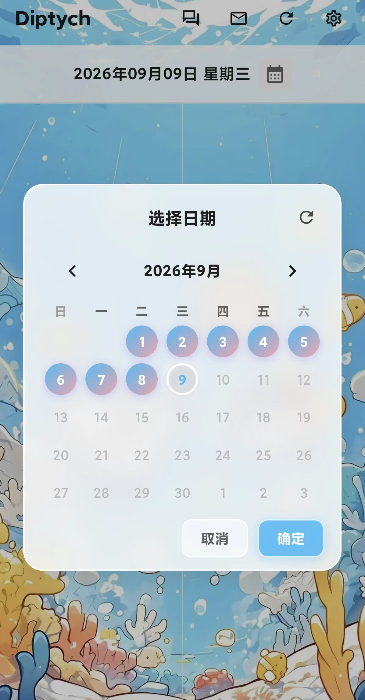
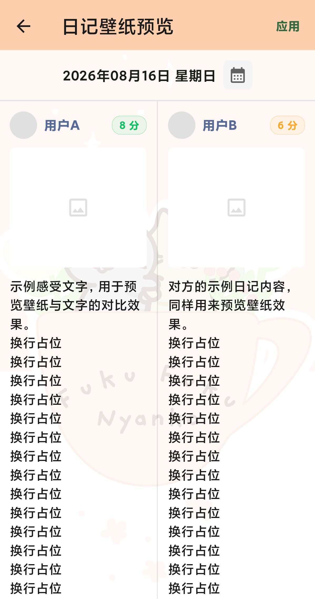
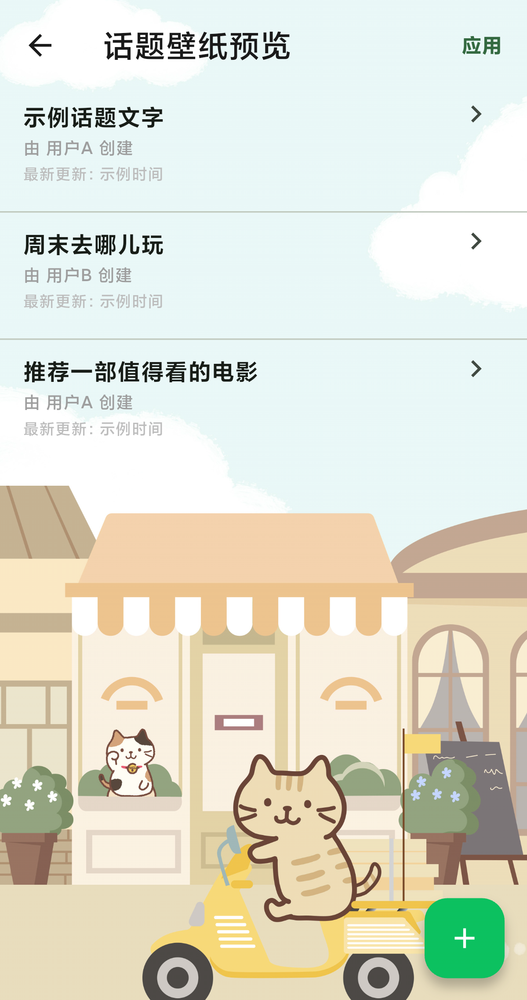

<div align="center">


# Diptych

双联画，各自的视角，共同的日子。

><div align="left">
>Diptych 是一款专为两人设计的日记 App。每天双方各记一条日记，包含照片、心情分与文字感受；主界面以左右分屏同时展示两人的当日内容，如同一幅双联画 —— Diptych。
></div>

[]()
[]()
[]()
[]()
[]()
[]()
[]()

</div>

## 预览

<div align="center">
  
  &nbsp;&nbsp;&nbsp;
  
  &nbsp;&nbsp;&nbsp;
  
  <br/>
  <em>软件主页 · 分屏日记 · 话题广场</em>
</div>

---

## 目录

- [预览](#预览)
- [功能特性](#功能特性)
- [技术栈](#技术栈)
- [项目结构](#项目结构)
- [快速开始](#快速开始)
  - [环境要求](#环境要求)
  - [获取代码](#获取代码)
  - [配置密钥](#配置密钥)
  - [配置后端地址](#配置后端地址)
  - [安装依赖](#安装依赖)
  - [本地运行](#本地运行)
  - [构建 Release APK](#构建-release-apk)
- [隐私与数据](#隐私与数据)
- [贡献指南](#贡献指南)
- [License](#license)

## 功能特性

- 🔐 **密钥登录** — 双方各持独立密钥，本地验证，无账号体系、无第三方登录
- 🖼️ **每日双联** — 每天各写一条日记，支持多图照片、心情分（1–10）与文字感受
- ↔️ **左右分屏** — 主界面同时呈现两人当日内容，随时回看对方的记录
- 💬 **互动评论** — 在对方（或自己）的日记下留言、回复，支持多级嵌套
- 📸 **实况照片 (Live Photo)** — 支持 Android（小米/澎湃、荣耀、Pixel、三星等）动态照片与 iOS 实况照片的高速解析与无损提取；定制微信风格相册多选器，支持独立控制单张图片的实况开关；支持微信同款原画质全屏大图预览与无感轻触播放，日记卡片与缩略图专属动态角标展示
- 📬 **信箱与通知中心** — 实时同步对方发布日记、评论、回复及话题动态；顶栏红点与未读计数感知，支持一键全部已读、单条已读与点击快速定位至对应日记或话题详情
- 📅 **双人日历与状态区分** — 日历采用双方独立标记配色体系（己方已记、对方已记、双人同记 135° 专属双色渐变）；支持磨砂玻璃弹层交互、日记与日历纯本地零网络开销强一致同步与全量联网刷新
- 🗂️ **话题广场** — 发起 / 参与话题讨论，不局限于当日内容，操作采用统一磨砂玻璃悬浮按钮
- 🎨 **壁纸与视觉定制** — 支持日记主页与话题广场自定义壁纸，自由调节模糊度与透明度，提供全屏实时预览与区域调整
- 📤 **智能串行上传与画廊预览** — 选图即触发后台串行静默上传，降低弱网突发并发压力；支持单张状态感知（等待/上传中/重试）、断点续传与全屏手势大图预览/缩放/删除
- 🛡️ **草稿防丢与容灾机制** — 自动持久化草稿文字、已上传图片 URL 与实况开关状态映射，异常退出或发布失败时不丢进度、不重复上传
- 🪟 **小窗自适应与比例缩放** — 针对折叠屏、平板及厂商（小米、荣耀等）悬浮小窗模式异常 Window Insets 进行系统级矫正；核心布局支持基准比例缩放，避免界面挤压与溢出
- 🔋 **前台保活与 WakeLock** — 引入 Android 前台常驻通知服务与系统级 CPU/屏幕唤醒锁，防止大文件传输与后台下载被系统休眠中断
- ⚡ **满速断点下载更新** — 集成系统级满速多线程/分块断点续传下载引擎，支持通知栏与应用内进度实时展示，下载完毕自动触发安装
- 📡 **离线可用** — 本地多级缓存策略：日记、通知与日历标记本地持久化，断网也能查看，网络恢复后静默同步
- ✂️ **头像裁剪** — 支持自定义头像，内置多比例裁剪功能

## 技术栈

| 层 | 技术 |
|---|---|
| 框架 | Flutter 3.x / Dart 3.12+ |
| 状态管理 | [Riverpod](https://riverpod.dev/) 3.x (`flutter_riverpod 3.4.2`) |
| 网络与传输 | `package:http` — REST API + 分片断点上传 |
| 图片缓存 | `cached_network_image` + `flutter_cache_manager` |
| 本地存储 | `shared_preferences`（日记/通知/日历标记本地缓存 + 登录态 + 草稿与上传状态元数据） |
| 相册与图片选择 | `wechat_assets_picker`（微信风格相册多选） + `image_picker`（拍照） |
| 实况照片与视频流 | 自研 `MotionPhotoHelper` 二进制流提取引擎 + `video_player`（实况播放） |
| 图片预览 / 裁剪 | `photo_view`（微信同款手势缩放与切页） + `image_cropper`（多比例头像裁剪） |
| 日历 | `table_calendar`（定制双人状态着色与磨砂玻璃交互） |
| 窗口与厂商适配 | 原生 `MethodChannel` 厂商识别 + Window Insets 规范化矫正 + 响应式比例缩放 |
| 本地化 | `flutter_localizations` + `intl`（简体中文本地化） |
| 版本更新与下载 | `package_info_plus` + `open_filex` + 系统级满速断点下载引擎 |
| 传输保活 | Android Foreground Service（前台通知服务） + WakeLock 唤醒锁 |

## 项目结构

```
lib/
├── main.dart                  # 入口，启动时清理旧安装包与全局初始化
├── app.dart                   # 根组件，根据登录状态路由与小窗 Insets 矫正
├── constants/
│   ├── api_config.dart        # 后端 API 地址配置（git 忽略，提供模板）
│   ├── app_theme.dart         # 全局主题（颜色、文字样式）
│   ├── secrets.dart           # 双方密钥配置（git 忽略，提供模板）
│   └── strings.dart           # 中文字符串常量
├── models/
│   ├── app_notification.dart  # 互动通知模型（日记/评论/话题通知、跳转元数据）
│   ├── app_user.dart          # 用户模型（uid / nickname / avatarUrl）
│   ├── calendar_marked_dates.dart # 日历双人记录状态模型（单人/双人同记）
│   ├── moment.dart            # 日记模型（含评论 Comment 与实况属性）
│   └── topic.dart             # 话题 / 帖子模型
├── providers/
│   ├── auth_provider.dart     # 认证状态、用户数据加载
│   ├── day_moment_provider.dart # 当日日记（缓存优先 + 后台刷新 + 日历状态联动）
│   ├── notification_provider.dart # 未读通知计数与通知列表状态管理
│   ├── selected_date_provider.dart # 当前选中的日期状态
│   └── wallpaper_provider.dart # 背景壁纸与透明度/模糊度状态
├── screens/
│   ├── login_screen.dart      # 密钥登录
│   ├── feed_screen.dart       # 主页（分屏日记 + 日历入口 + 评论逻辑 + 信箱入口）
│   ├── edit_moment_screen.dart # 日记编辑（串行异步上传 + 实况开关 + 断点续传 + 容灾）
│   ├── notification_screen.dart # 信箱与通知列表（未读标记、跳转上下文、一键已读）
│   ├── profile_screen.dart    # 个人中心（设置 / 更新 / 缓存清理）
│   ├── topics_screen.dart     # 话题列表
│   ├── topic_detail_screen.dart # 话题详情与互动
│   ├── topic_post_screen.dart # 话题发布（图片预览 + 异步上传）
│   ├── wallpaper_settings_screen.dart # 壁纸参数配置
│   ├── wallpaper_preview_screen.dart # 壁纸全屏实时效果预览
│   └── wallpaper_zoom_screen.dart # 壁纸缩放与区域调整
├── services/
│   ├── api_service.dart       # REST API 调用（用户、日记、日历标记、消息通知）
│   ├── auth_service.dart      # 密钥验证 + SharedPreferences 持久化
│   ├── cache_service.dart     # 日记 / 用户 / 日历双人状态 / 壁纸本地缓存
│   ├── draft_service.dart     # 草稿（文本 + 本地与已上传图片元数据 + 实况标识）
│   ├── notification_service.dart # 通知持久化缓存与服务端队列同步
│   ├── storage_service.dart   # 图片上传与分片断点续传
│   ├── topic_service.dart     # 话题 REST API
│   └── update_service.dart    # 版本检测与 APK 满速断点下载安装
├── utils/
│   ├── cache_helper.dart      # 缓存大小计算与清理
│   ├── date_helper.dart       # 日期格式化工具
│   ├── diptych_asset_picker.dart # 定制相册选择器（微信风格交互、实况角标与独立开关）
│   ├── file_helper.dart       # 文件与 MIME 类型工具
│   ├── foreground_service_helper.dart # Android 前台保活服务通信通道
│   ├── motion_photo_helper.dart # 实况照片解析器（多厂商动态照片二进制流提取与就地缓存）
│   ├── url_helper.dart        # 相对路径转完整 URL
│   └── wakelock_helper.dart   # 屏幕与 CPU WakeLock 保活
└── widgets/
    ├── avatar_widget.dart     # 头像组件
    ├── calendar_picker.dart   # 双人状态日历选择弹窗（磨砂玻璃材质、配色状态指示）
    ├── date_header.dart       # 日期切换栏与快速回到今天
    ├── day_split_view.dart    # 左右分屏日记展示容器
    ├── frosted_pill_button.dart # 统一磨砂玻璃悬浮胶囊按钮
    ├── image_gallery.dart     # 全屏手势画廊（原图高清预览、微信手势与实况轻触播放）
    ├── live_photo_badge.dart  # 实况照片动态徽标与开关角标
    ├── moment_card.dart       # 单条日记卡片（含实况角标与评论树）
    ├── photo_grid_picker.dart # 九宫格图片选择器（串行上传状态、实况角标切换与拖拽排序）
    └── wallpaper_layer.dart   # 全局/局部壁纸背景渲染层
```

## 快速开始

### 环境要求

- Flutter SDK 3.x / Dart SDK ≥ 3.12.2（运行 `flutter --version` 确认）
- Android SDK Platform 36 + Build-Tools 36
- JDK 17

### 获取代码

```bash
git clone https://github.com/Breeze1733/Diptych.git
cd Diptych
```

### 配置密钥

在 `lib/constants/` 下创建 `secrets.dart`（该文件已在 `.gitignore` 中排除，不会提交到仓库）：

```dart
class Secrets {
  Secrets._();

  /// 用户 A 的密钥
  static const String keyA = '<用户A的密钥>';

  /// 用户 B 的密钥
  static const String keyB = '<用户B的密钥>';

  /// 验证密钥，返回用户角色，无效返回 null
  static String? validateKey(String key) {
    if (key == keyA) return 'A';
    if (key == keyB) return 'B';
    return null;
  }
}
```

> 登录时通过 `Secrets.validateKey()` 校验密钥，仓库内不包含任何真实密钥。

### 配置后端地址

App 对接自托管 REST API，后端代码不在本仓库中。在 `lib/constants/` 下创建 `api_config.dart`（该文件已在 `.gitignore` 中排除，不会提交到仓库）：

```dart
class ApiConfig {
  ApiConfig._();

  /// 站点根地址（用于拼接图片等相对路径）
  static const String siteUrl = '<你的站点根地址>';

  /// REST API 基础地址
  static const String apiBaseUrl = '$siteUrl/api';
}
```

> 全部网络请求均通过 `ApiConfig.apiBaseUrl` / `ApiConfig.siteUrl` 读取地址，无需逐个修改，仓库内不包含任何实际后端地址。

### 安装依赖

```bash
flutter pub get
```

### 本地运行

```bash
flutter run
```

### 构建 Release APK

```bash
flutter build apk --release
```

产物路径：`build/app/outputs/flutter-apk/app-release.apk`

## 隐私与数据

- 🔒 **数据自持** — 日记、图片与话题数据全部存储于自托管后端，不经过任何第三方云服务
- 🔑 **密钥本地验证** — 登录密钥仅在本机校验，无账号体系，不上传账号信息
- 📴 **离线可读** — 已缓存的内容在断网时仍可浏览

## 贡献指南

欢迎提交 Issue 与 Pull Request！

- **发现问题**：请先搜索是否已有类似 [Issue](https://github.com/Breeze1733/Diptych/issues)，若无则新建并描述复现步骤与设备信息
- **提交代码**：Fork 仓库 → 基于 `main` 分支新建特性分支 → 提交 PR，请确保代码通过 `flutter analyze` 检查
- **代码风格**：遵循 `analysis_options.yaml` 中的 `flutter_lints` 规则

## License

[MIT](./LICENSE)

Copyright © 2026 Breeze1733
