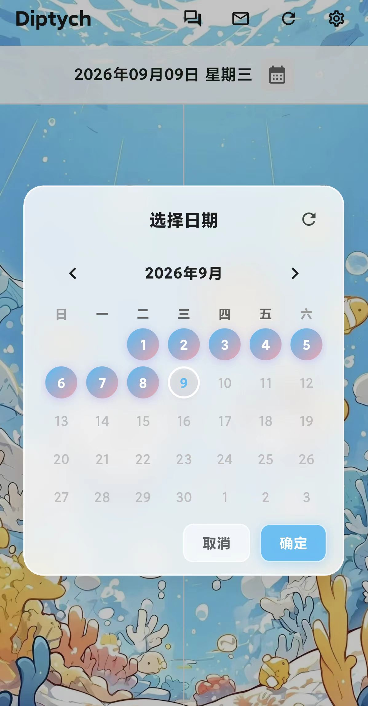
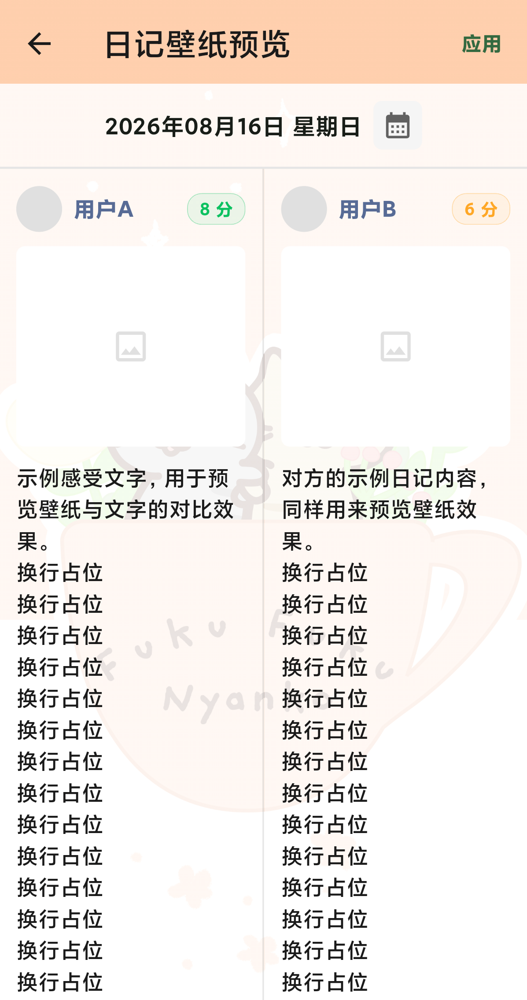
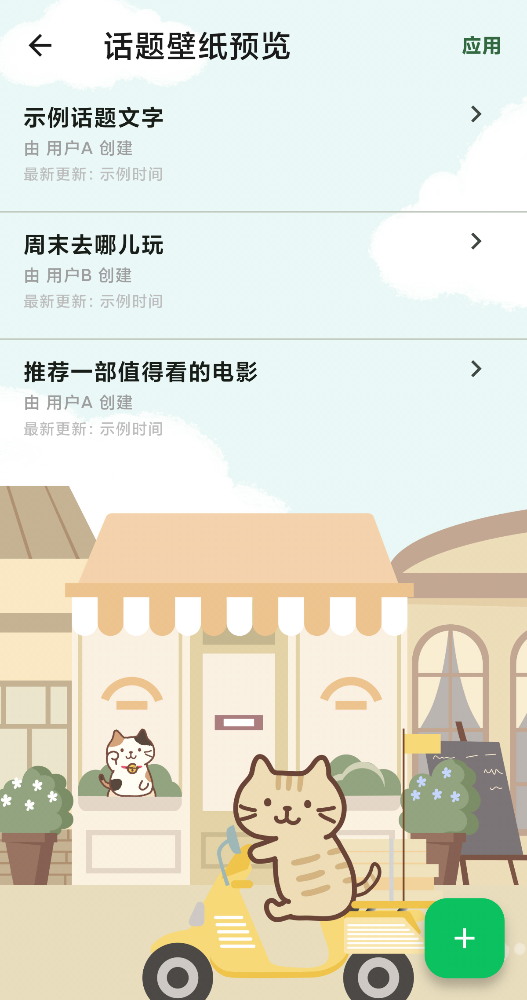

<div align="center">


# Diptych

双联画，各自的视角，共同的日子。

><div align="left">
>Diptych 是一款专为两人设计的日记 App。每天双方各记一条日记，包含照片、心情分与文字感受；主界面以左右分屏同时展示两人的当日内容，如同一幅双联画 —— Diptych。
></div>

[]()
[]()
[]()
[]()
[]()
[]()
[]()

</div>

## 预览

<div align="center">
  
  &nbsp;&nbsp;&nbsp;
  
  &nbsp;&nbsp;&nbsp;
  
  <br/>
  <em>软件主页 · 分屏日记 · 话题广场</em>
</div>

---

## 目录

- [预览](#预览)
- [功能特性](#功能特性)
- [技术栈](#技术栈)
- [项目结构](#项目结构)
- [后端接口](#后端接口)
- [快速开始](#快速开始)
  - [环境要求](#环境要求)
  - [获取代码](#获取代码)
  - [配置密钥](#配置密钥)
  - [配置后端地址](#配置后端地址)
  - [安装依赖](#安装依赖)
  - [本地运行](#本地运行)
  - [构建 Release APK](#构建-release-apk)
- [隐私与数据](#隐私与数据)
- [贡献指南](#贡献指南)
- [License](#license)

## 功能特性

- 🔐 **密钥登录** — 双方各持独立密钥，本地验证，无账号体系、无第三方登录
- 🖼️ **每日双联** — 每人每天一条日记，支持多图照片、可选心情分（1–10）与文字感受；默认查看日期以本机时间早上 6:00 为界，凌晨 0:00–5:59 算前一天
- ↔️ **左右分屏** — 主界面同时呈现两人当日内容，随时回看对方的记录
- 💬 **互动评论** — 在对方（或自己）的日记下留言、回复，支持多级嵌套
- 📸 **实况照片** — 识别 Android 多厂商 JPEG 中内嵌的 MP4，支持提取、播放与保存时的厂商元数据适配；定制相册多选器提供单张实况开关，开启时上传完整动态图，关闭时提取静态图。当前仓库提供 Android 平台工程
- 📬 **信箱与通知中心** — 初始化通知列表、进入信箱及相关刷新操作时主动拉取日记、评论和话题通知；服务端取出后清空对应队列，客户端保存历史与已读状态。支持未读计数、单条/全部已读、清空信箱和跳转到对应日期或话题
- 📅 **双人日历** — 区分己方、对方与双方都已记录的日期，支持双色标记和磨砂玻璃弹窗；优先读取本地日期缓存，加载日记时补充对应日期标记，手动刷新时联网全量同步
- 🔎 **日记搜索** — 搜索双方日记正文与评论，按日期从新到旧返回；支持输入防抖、关键词摘要高亮、游标分页和点击回到对应日期
- 🗂️ **话题广场** — 创建话题、查看讨论、发布纯文字帖子及删除自己的帖子；发帖支持保存和恢复文字草稿
- 🎨 **壁纸定制** — 日记与话题分别设置壁纸；选图后按 9:16 裁剪，支持全屏预览和透明度调整，设置本地优先并同步至后端；可一键设为白色背景，该操作仅保存在本机并保留原壁纸，方便恢复
- 📤 **串行预上传与画廊** — 选图即触发后台串行上传，单张图片按 1 MB 分片发送，失败分片和合并请求自动重试；支持上传进度、失败重试、移除和拖拽排序，以及全屏图片预览、缩放和保存
- 🛡️ **草稿与上传结果复用** — 日记草稿保存文字、心情、混合本地/远程图片顺序、实况状态与已上传 URL；恢复时复用已完成的图片上传，未完成的图片重新启动上传。提供手动存草稿、退出保留草稿和发布失败自动保存，评论与话题帖子也支持文字草稿
- 🪟 **小窗适配** — 在 Flutter 根组件中修正异常的 MediaQuery 顶部/底部 Insets，主页与日记布局根据窗口尺寸缩放
- 🔋 **传输保活** — Android 前台服务展示上传、图片预缓存和更新下载进度，配合带超时的 CPU WakeLock 降低后台传输被休眠打断的概率
- ⚡ **应用内更新** — 启动后静默检查版本，也可在设置中手动检查；通过 Dart HTTP 流下载 APK，网络中断后用 HTTP Range 重连续传，下载完成调起系统安装，下次启动清理旧安装包
- 📡 **缓存优先与离线浏览** — 用户、日记、日历和通知保存到本地，图片使用磁盘缓存；已缓存内容可离线浏览，日记缓存命中后后台刷新。发布、搜索、话题加载和首次获取未缓存内容需要网络
- 🖼️ **上传后直接缓存** — 日记发布成功后，将本地已上传图片写入 DefaultCacheManager，避免查看自己的日记时再次下载同一张图片
- ✂️ **头像裁剪** — 支持自定义头像，内置多比例裁剪功能
- 📶 **网络检测** — 设置页手动发起最多 3 次轻量请求，显示服务器响应耗时的中位数及快/正常/偏慢/很慢分档；支持取消、10 秒重测冷却与超时、限流、Cloudflare 验证及缓存响应识别

## 技术栈

| 层 | 技术 |
|---|---|
| 框架 | Flutter ≥ 3.47.0 / Dart SDK `^3.13.0`，当前平台工程为 Android |
| 状态管理 | [Riverpod](https://riverpod.dev/) 3.x (`flutter_riverpod 3.4.2`) |
| 网络与传输 | `package:http` — REST API、串行分片上传与局部重试、HTTP Range 下载重连续传 |
| 图片缓存 | `cached_network_image` + `flutter_cache_manager` |
| 本地存储 | `shared_preferences`（日记/通知/日历标记本地缓存 + 登录态 + 草稿与上传状态元数据） |
| 相册与图片选择 | `wechat_assets_picker`（微信风格相册多选） + `image_picker`（拍照） |
| 实况照片与视频流 | 自研 `MotionPhotoHelper` 二进制流提取引擎 + `video_player`（实况播放） |
| 图片预览 / 裁剪 | `photo_view`（微信同款手势缩放与切页） + `image_cropper`（多比例头像裁剪） |
| 日历 | `table_calendar`（定制双人状态着色与磨砂玻璃交互） |
| 窗口与厂商适配 | Flutter MediaQuery Insets 修正与比例缩放；原生 `MethodChannel` 厂商识别、媒体扫描 |
| 本地化 | `flutter_localizations` + `intl`（简体中文本地化） |
| 版本更新与下载 | `package_info_plus` + Dart HTTP 流式下载 + 原生 APK 安装通道（`open_filex` 兜底） |
| 传输保活 | Android Foreground Service（前台通知服务） + CPU PARTIAL_WAKE_LOCK |

## 项目结构

```
lib/
├── main.dart                  # 入口，启动时清理旧安装包与全局初始化
├── app.dart                   # 根组件，根据登录状态路由与小窗 Insets 矫正
├── constants/
│   ├── api_config.dart        # 后端 API 地址配置（git 忽略，创建方式见下文）
│   ├── app_theme.dart         # 全局主题（颜色、文字样式）
│   ├── settings_theme.dart    # 设置页与壁纸设置的暖白/深蓝灰配色
│   ├── secrets.dart           # 双方密钥配置（git 忽略，创建方式见下文）
│   └── strings.dart           # 中文字符串常量
├── models/
│   ├── app_notification.dart  # 互动通知模型（日记/评论/话题通知、跳转元数据）
│   ├── app_user.dart          # 用户模型（uid / nickname / avatarUrl）
│   ├── calendar_marked_dates.dart # 日历双人记录状态模型（单人/双人同记）
│   ├── network_diagnostics.dart # 网络检测结果、失败类型及响应耗时分档
│   ├── moment.dart            # 日记与评论模型（图片 URL、心情、正文、回复关系）
│   └── topic.dart             # 话题 / 帖子模型
├── providers/
│   ├── auth_provider.dart     # 认证状态、用户数据加载
│   ├── day_moment_provider.dart # 当日日记（缓存优先 + 后台刷新 + 日历状态联动）
│   ├── notification_provider.dart # 未读通知计数与通知列表状态管理
│   ├── selected_date_provider.dart # 当前选中的日期状态
│   └── wallpaper_provider.dart # 日记/话题壁纸与透明度，本地优先初始化
├── screens/
│   ├── login_screen.dart      # 密钥登录
│   ├── feed_screen.dart       # 主页（分屏日记、日历、评论、搜索及信箱入口）
│   ├── diary_search_screen.dart # 日记/评论搜索（高亮摘要、游标分页、日期跳转）
│   ├── edit_moment_screen.dart # 日记编辑（串行预上传、实况开关、草稿恢复、缓存转移）
│   ├── notification_screen.dart # 信箱与通知列表（未读标记、跳转上下文、一键已读）
│   ├── profile_screen.dart    # 个人中心（设置 / 网络检测 / 更新 / 缓存清理）
│   ├── topics_screen.dart     # 话题列表
│   ├── topic_detail_screen.dart # 话题详情与互动
│   ├── topic_post_screen.dart # 话题纯文字发帖与草稿
│   ├── wallpaper_settings_screen.dart # 壁纸选图、9:16 裁剪、上传及白色背景设置
│   └── wallpaper_preview_screen.dart # 壁纸全屏预览与透明度调整
├── services/
│   ├── api_service.dart       # REST API（用户、日记、搜索、日历标记、通知）
│   ├── auth_service.dart      # 密钥验证 + SharedPreferences 持久化
│   ├── cache_service.dart     # 日记、用户及双人日历状态缓存
│   ├── draft_service.dart     # 日记/评论/帖子草稿，图片持久化与发布后缓存转移
│   ├── notification_service.dart # 通知持久化缓存与服务端队列同步
│   ├── network_diagnostics_service.dart # 轻量网络探测、响应校验、超时与取消
│   ├── storage_service.dart   # 1 MB 分片上传、局部重试、合并、中止及删除图片
│   ├── topic_service.dart     # 话题 REST API
│   └── update_service.dart    # 版本检测、APK 流式下载重连续传、安装及清理
├── utils/
│   ├── cache_helper.dart      # 缓存大小计算与清理
│   ├── date_helper.dart       # 日期格式化、6:00 换日、+08:00 时间序列化
│   ├── diptych_asset_picker.dart # 定制相册选择器（微信风格交互、实况角标与独立开关）
│   ├── file_helper.dart       # 文件与 MIME 类型工具
│   ├── foreground_service_helper.dart # Android 前台保活服务通信通道
│   ├── motion_photo_helper.dart # 实况照片解析器（多厂商动态照片二进制流提取与就地缓存）
│   ├── url_helper.dart        # 相对路径转完整 URL
│   └── wakelock_helper.dart   # CPU WakeLock 原生通道
└── widgets/
    ├── avatar_widget.dart     # 头像组件
    ├── calendar_picker.dart   # 双人状态日历选择弹窗（磨砂玻璃材质、配色状态指示）
    ├── date_header.dart       # 日期切换栏与快速回到今天
    ├── day_split_view.dart    # 左右分屏日记展示容器
    ├── frosted_pill_button.dart # 统一磨砂玻璃悬浮胶囊按钮
    ├── image_gallery.dart     # 全屏手势画廊（原图高清预览、微信手势与实况轻触播放）
    ├── live_photo_badge.dart  # 实况照片动态徽标与开关角标
    ├── moment_card.dart       # 单条日记卡片（含实况角标与评论树）
    ├── network_diagnostics_card.dart # 手动网络检测、响应分档、详情及冷却状态
    ├── photo_grid_picker.dart # 九宫格图片选择器（串行上传状态、实况角标切换与拖拽排序）
    └── wallpaper_layer.dart   # 全局/局部壁纸背景渲染层
```

`android/` 包含 Kotlin 原生通道、传输前台服务与启动图标资源；`assets/` 保存应用图片及 README 预览图。

应用标志使用透明圆角 PNG，Android 同时提供各密度启动图标、自适应图标及单色主题图标，资源位于 `assets/` 与 `android/app/src/main/res/`。

## 后端接口

客户端通过 REST API 访问自托管后端，主要接口如下：

| 用途 | 接口（相对于 API 基础地址） |
|---|---|
| 用户 | `POST /users/ensure`、`GET /users/:uid`、`PUT /users/:uid` |
| 日记 | `GET /moments?date_str=…&author_ids=A,B`、`POST /moments`、`PUT /moments/:id` |
| 搜索与日历 | `GET /moments/search`、`GET /moments/calendar/dates` |
| 图片 | `POST /upload/chunk`、`POST /upload/merge`、`POST /upload/abort`、`POST /upload/delete` |
| 话题与帖子 | `GET /topics`、`POST /topics`、`GET /topics/:id`、`POST /topics/:id/posts`、`DELETE /topics/:id/posts/:postId` |
| 通知 | `GET /notifications?user_id=…`（取出后从服务端队列清除） |
| 更新 | `GET /version/latest`、`GET /version/download` |

## 快速开始

### 环境要求

- Flutter 稳定版 ≥ 3.47.0，随附 Dart SDK ≥ 3.13.0 且 < 4.0.0（当前验证环境：Flutter 3.47.7 / Dart 3.13.5；运行 `flutter --version` 确认）
- Android SDK Platform 37.0 与 Build-Tools `37.0.0`；应用及 Android 插件统一使用 `compileSdk = 37`，应用 `targetSdk` 保持 36，最低 Android 版本仍由 Flutter 的 `minSdkVersion` 决定
- Android NDK `28.2.13676358`（构建配置指定）
- JDK 25；应用 Java / Kotlin 编译目标为 25，项目 Gradle Wrapper 使用 Gradle 9.8.1（`bin` 发行包），Android Gradle Plugin 为 9.4.1，Kotlin Gradle Plugin 为 2.4.21。`image_cropper` 与 `open_filex` 的 Java 8 默认目标在根 Gradle 配置中统一为 25
- 当前 Flutter Android 插件仍使用旧 DSL 与 Variant API，`android/gradle.properties` 保留 `android.newDsl=false` 和 `android.builtInKotlin=false` 兼容配置
- `JAVA_HOME` 和 `PATH` 应指向 JDK 25，运行 `flutter doctor -v` 确认 Flutter 实际使用的 Java。项目使用 `jvmToolchain(25)` 明确应用的编译工具链；升级电脑 JDK 不会自动修改第三方插件的编译目标
- JDK 25 下可设置 `GRADLE_OPTS=--enable-native-access=ALL-UNNAMED`，为 Gradle 启动进程的原生库加载提供所需权限，避免 `System::load` 的原生访问提示
- 可用的自托管后端与 Android 真机或模拟器；当前 Android 构建仅包含 `arm64-v8a`，请使用 ARM64 设备或模拟器

Gradle Wrapper 使用 `https://services.gradle.org/distributions/gradle-9.8.1-bin.zip`，默认缓存在用户目录的 `.gradle/wrapper/dists/`。同一账号下，使用相同下载地址且未另设 `GRADLE_USER_HOME` 的项目会复用这份缓存；`bin` 与 `all` 下载地址不同，缓存分别保存。

### 获取代码

```bash
git clone https://github.com/Breeze1733/Diptych.git
cd Diptych
```

### 配置密钥

在 `lib/constants/` 下创建 `secrets.dart`（该文件已在 `.gitignore` 中排除，不会提交到仓库）：

```dart
class Secrets {
  Secrets._();

  /// 用户 A 的密钥
  static const String keyA = '<用户A的密钥>';

  /// 用户 B 的密钥
  static const String keyB = '<用户B的密钥>';

  /// 验证密钥，返回用户角色，无效返回 null
  static String? validateKey(String key) {
    if (key == keyA) return 'A';
    if (key == keyB) return 'B';
    return null;
  }
}
```

> 登录时通过 `Secrets.validateKey()` 在本地校验密钥，只保存用户角色 A/B。密钥配置不纳入 Git；本地校验不等同于服务端接口鉴权。

### 配置后端地址

App 对接自托管 REST API，本仓库提供客户端代码，后端需自行部署并实现上文接口。在 `lib/constants/` 下创建 `api_config.dart`（该文件已在 `.gitignore` 中排除，不会提交到仓库）：

```dart
class ApiConfig {
  ApiConfig._();

  /// 站点根地址（用于拼接图片等相对路径）
  static const String siteUrl = '<你的站点根地址>';

  /// REST API 基础地址
  static const String apiBaseUrl = '$siteUrl/api';
}
```

> 客户端 API 请求使用 `ApiConfig.apiBaseUrl`，相对图片路径通过 `ApiConfig.siteUrl` 补全。服务端返回的绝对 URL 会保留原地址，因此迁移部署时也需更新后端对应配置。

### 安装依赖

```bash
flutter pub get
```

### 本地运行

```bash
flutter run
```

### 构建 Release APK

```bash
flutter build apk --release
```

产物路径：`build/app/outputs/flutter-apk/app-release.apk`

上述工具链已在 Flutter 3.47.7 / Dart 3.13.5 / JDK 25 环境中通过 Release APK 构建验证。

## 隐私与数据

- 🔒 **自托管数据** — 日记、图片与话题数据发送至配置的后端；客户端没有集成第三方账号登录或云数据库 SDK
- 🔑 **本地登录校验** — 登录密钥在本机校验；API 请求携带用户角色/ID，当前客户端未发送登录密钥或鉴权令牌
- 📴 **本地缓存与草稿** — 用户、日记、日历、通知及草稿元数据保存在 SharedPreferences，草稿图片保存在应用文档目录；图片和提取的视频使用本地缓存。已缓存日记与通知可离线查看，通知已读状态也由本机保存

## 贡献指南

欢迎提交 Issue 与 Pull Request！

- **发现问题**：请先搜索是否已有类似 [Issue](https://github.com/Breeze1733/Diptych/issues)，若无则新建并描述复现步骤与设备信息
- **提交代码**：Fork 仓库 → 基于 `main` 分支新建特性分支 → 提交 PR，按改动需要运行 `flutter analyze` 静态检查或在设备上验证
- **代码风格**：遵循 `analysis_options.yaml` 中的 `flutter_lints` 规则

## License

[MIT](./LICENSE)

Copyright © 2026 Breeze1733
